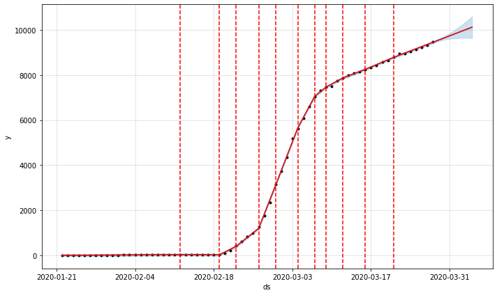

# Coronavirus Confirmed Prediction

### Facebook Prophet 모듈을 이용해서 코로나바이러스19(SARS-COV-2) 확진자 추세를 예측해보자 합니다. 

- [ENG: Click Here for Google Collab Walkthrough](https://colab.research.google.com/drive/1NN_vY_hp9gmHfqqRi778-V_7PRRXG8ww)
- [국문: 구글 콜랩을 이용해서 코드를 실행해보세요](https://colab.research.google.com/drive/1NN_vY_hp9gmHfqqRi778-V_7PRRXG8ww)

## Dependency and Modules

- Python 3.x
- [fbprophet](https://facebook.github.io/prophet/docs/quick_start.html)
  - [About y hat](https://www.statisticshowto.datasciencecentral.com/y-hat-definition/)
- pandas
- plotly

## Dataset

- 코로나바이러스19로 인한 확진자, 사망자, 데이터셋은 매일 업데이트 되며, 출처는 다음과 같습니다. 

- [Number of Confirmed Cases (Daily Updated)](https://raw.githubusercontent.com/datasets/covid-19/master/data/time-series-19-covid-combined.csv)
