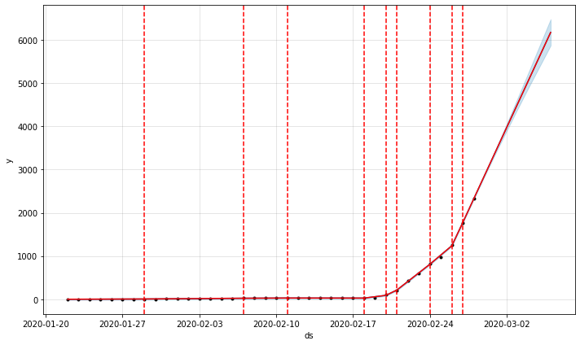

# Coronavirus Confirmed Prediction

### Facebook Prophet 모듈을 이용해서 코로나바이러스19(SARS-COV-2) 확진자 추세를 예측해보자 합니다. 

- [Click Here for Google Collab Walkthrough](https://drive.google.com/file/d/1C9hAgLVQpSw4JFZLjXV8xANfHWXMToQg/view?usp=sharing)
- [구글 콜랩을 이용해서 코드를 실행해보세요](https://drive.google.com/file/d/1C9hAgLVQpSw4JFZLjXV8xANfHWXMToQg/view?usp=sharing)

## Dependency and Modules

- Python 3.x
- [fbprophet](https://facebook.github.io/prophet/docs/quick_start.html)
  - [About y hat](https://www.statisticshowto.datasciencecentral.com/y-hat-definition/)
- pandas
- plotly

## Dataset

- 코로나바이러스19로 인한 확진자, 사망자, 데이터셋은 매일 업데이트 되며, 출처는 다음과 같습니다. 

- [Number of Confirmed Cases (Daily Updated)](https://raw.githubusercontent.com/CSSEGISandData/COVID-19/master/csse_covid_19_data/csse_covid_19_time_series/time_series_19-covid-Confirmed.csv)
- [Number of Death (Daily Updated)](https://raw.githubusercontent.com/CSSEGISandData/COVID-19/master/csse_covid_19_data/csse_covid_19_time_series/time_series_19-covid-Deaths.csv)
- [Number of Recoveries(Daily Updated)](https://raw.githubusercontent.com/CSSEGISandData/COVID-19/master/csse_covid_19_data/csse_covid_19_time_series/time_series_19-covid-Recovered.csv)

